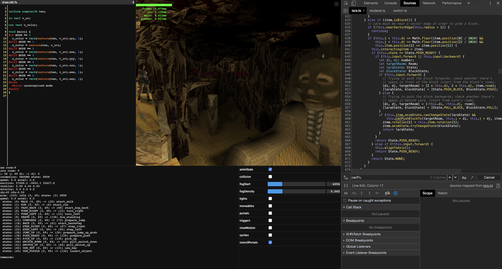

# jsRaider

A WebGL Tomb Raider engine written in TypeScript. 

If you're interested in open-source Tomb Raider engines, you should probably
check out [OpenTomb](http://opentomb.github.io/) or
[OpenLara](https://github.com/XProger/OpenLara), which are more fully featured.

jsRaider is just my hobby project for tinkering with. The focus of jsRaider is
on a PS1 inspired aesthetic but with no visible aliasing. This actually requires
a fair amount of care and feeling with regards to texture sampling & filtering.

# Installation

Clone with `git clone --recurse-submodules git@github.com:tommadams/jsraider.git`

Compile with `tsc -w`
